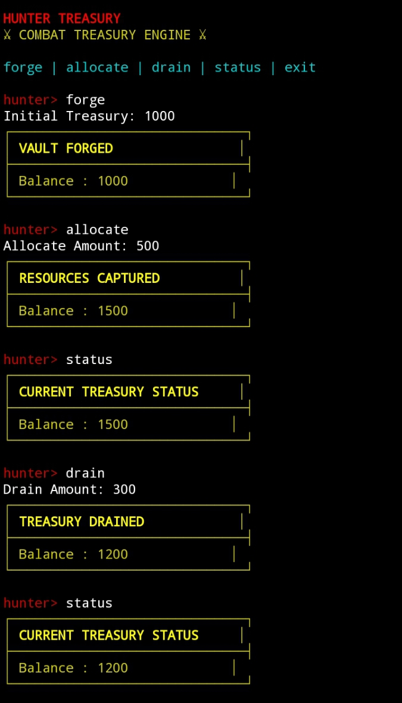

# 🔥 HUNTER TREASURY

⚔ Combat Treasury Simulation Engine  
A battle-style CLI treasury management system built with Node.js.

Hunter Treasury is a command-line treasury engine designed to simulate
resource forging, allocation, draining, and live balance tracking
in an aggressive combat-style interface.

---

## ⚔ Core Concept

Hunter Treasury transforms traditional balance tracking into a
combat-driven treasury simulation.

Instead of basic output logs, this engine presents:

- Structured battle panels
- Vault forging mechanics
- Resource capture system
- Drain validation checks
- Error combat alerts
- Clean shutdown sequence

---

## 🚀 Features

- ⚔ Forge initial treasury vault
- 💰 Allocate additional resources
- 🔻 Drain treasury with validation protection
- 📊 Live structured balance table
- ⚠ Insufficient balance detection
- 🧨 Error-safe command handling
- 🎮 Combat-styled CLI interface
- 🧱 Lightweight & fast execution

---

## 🖥 Command List

| Command   | Description |
|-----------|------------|
| forge     | Create initial treasury vault |
| allocate  | Add funds to treasury |
| drain     | Subtract funds (with validation) |
| status    | Show structured treasury table |
| exit      | Shutdown engine |

---

## ⚔ Interface Preview

Hunter Treasury uses a structured ASCII combat panel:

┌──────────────────────────────┐
│ VAULT FORGED                 │
├──────────────────────────────┤
│ Balance : 1000               │
└──────────────────────────────┘

Designed for impact, clarity, and command control.

---

## 🎬 Proof of Execution

### 1️⃣ Treasury Execution Flow
Demonstrates:
- Vault creation
- Resource allocation
- Balance updates

---

### 2️⃣ Error Handling & Exit
Demonstrates:
- Insufficient treasury protection
- Controlled shutdown

---

## 🧩 Project Structure

hunter-treasury/
│
├── index.js
├── package.json
├── README.md
├── SKILL.md
└── proof/
    ├── proof-execution.jpg
    └── proof-error-exit.jpg

---

## 🛠 Installation

git clone https://github.com/SukuyamaBugHunter/hunter-treasury.git  
cd hunter-treasury  
npm install  
node index.js  

---

## ⚙ Runtime Example

hunter> forge  
hunter> allocate  
hunter> status  
hunter> drain  
hunter> exit  

---

## 🧠 Technical Highlights

- Node.js CLI architecture
- State-based treasury management
- Input validation
- Dynamic balance updates
- Structured console formatting
- Clean module execution flow

---

## 🌐 Intercom Reference

This project is developed as a customized implementation within
the Intercom-Swap ecosystem structure.

It follows modular CLI logic and structured state management principles.

---

## 🧾 Trac Wallet

trac1auvydde4kszxlk8zdet5kk5sdnf6gc5cyhexqrxv2yte9fpsmx2qp2ey4q

---

## 🏁 Status

Active fork with custom implementation  
Execution proof included  
Error handling validated  
Ready for deployment  

🔥 Hunter Treasury – Built for impact, not simplicity.
